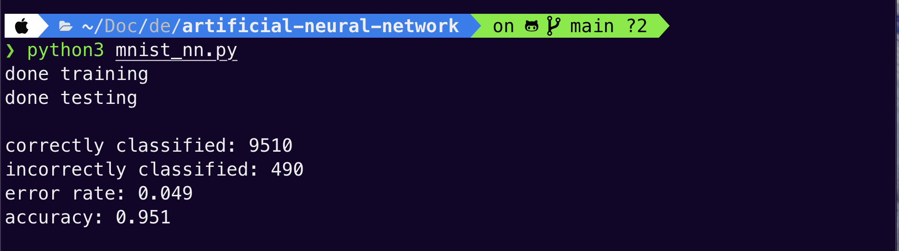

# Artificial Neural Network

## Description
This is a Python implementation of a very rudimentary 2 layer Neural Network class. The class features a method to feed forward a certain instance for a prediction and another method to train and adjust its weights based on a labelled data instance. I tested the neural network on a linearly inseparable problem like the XOR logic gate. I then tested it on the MNIST database of handwritten digits. With 784 input nodes, 64 hidden nodes and 10 output nodes, the net acheives about 94% accuracy on 10000 test images after being trained with 5 epochs on 60000 training images, which isn't too shabby 🤷 I compared my results with the same neural network implementation in Tensorflow and Tensorflow acheived about an accuracy of about 95-96%. 

## Instructions
Clone the repo and install the dependencies with 
```
pip install -r requirements.txt
```

Download the MNIST data from the link below and place all 4 ubyte files in a folder called *data*. Label them *training_images*, *training_labels*, *test_images* and *test_labels* accordingly. Run the mnist_nn module to test the custom neural network and measure its performance. Run the mnist_tf module to test a Tensorflow implementation of the same neural network architecture on the MNIST data as a comparison.

```
python3 mnist_nn.py
```

```
python3 mnist_tf.py
```

## Pictures
<div align="center">
  
</div>
<p align="center">
  Results of the neural network implementation.
</p>

## Technologies
- 
- 
- 
- MNIST database (http://yann.lecun.com/exdb/mnist/)<br />

---
*Made with <3 by Arnav, circa 2020*
